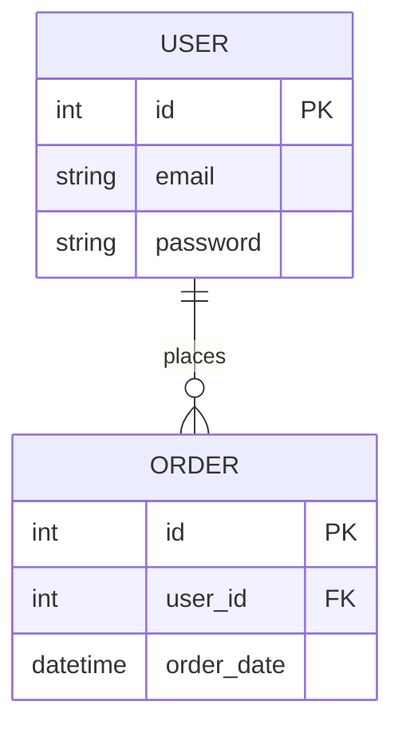

# Data Model

## 1. Entity Relationship Diagram (ERD)

```mermaid
erDiagram
    USER ||--o{ ORDER : places
    USER {
        int id PK
        string email
        string password
    }
    ORDER {
        int id PK
        int user_id FK
        datetime order_date
    }
```

## 2. Data Dictionary
Detailed description of database tables.
